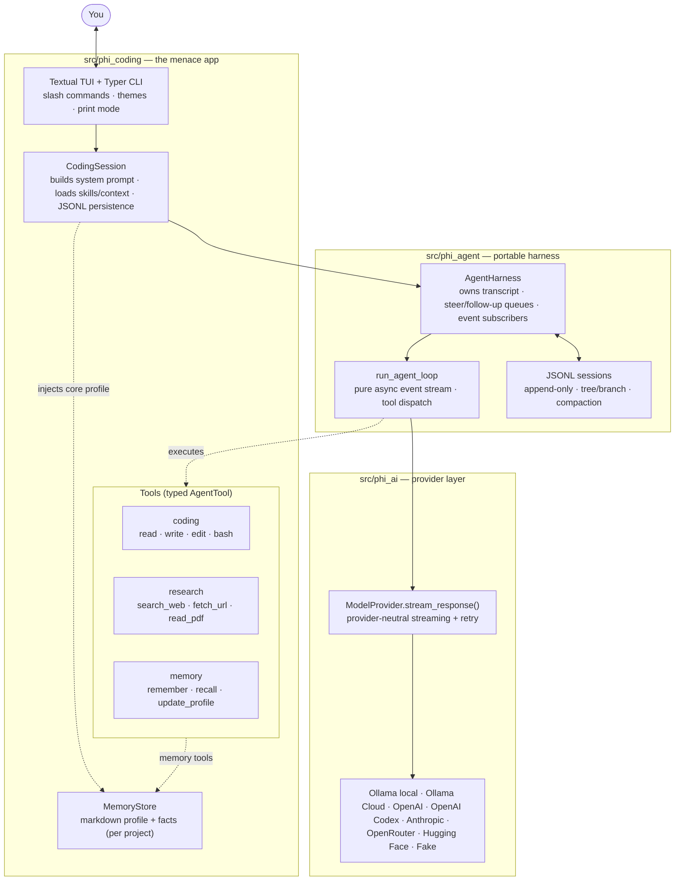
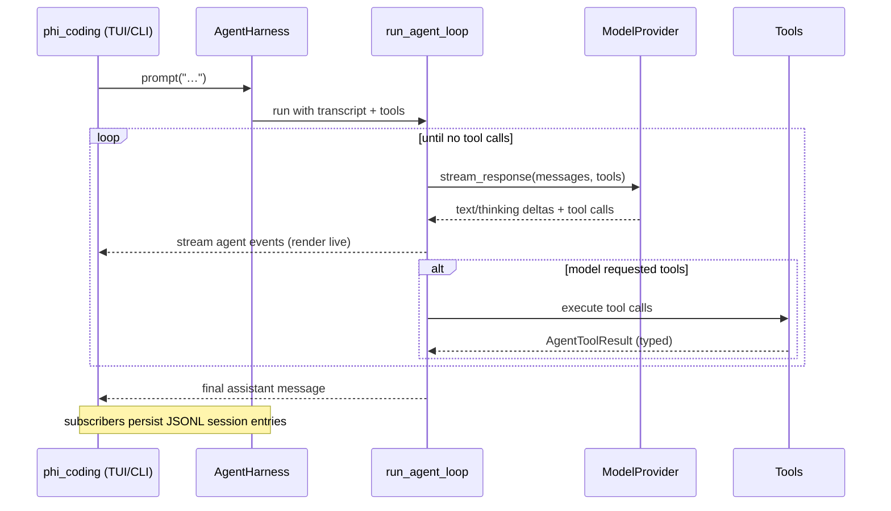

# menace

**A local research, study, and coding agent — built on a clean, Pi-style harness.**

menace runs fully local by default (via [Ollama](https://ollama.com)), streams its
work in a terminal UI, and remembers what you're working on across sessions. It is
built on the [**phi**](https://github.com/Manas-thakur/phi) agent architecture — a
provider-neutral, event-streaming harness with a strict separation between the
reusable agent brain and the app that uses it.

```
src/phi_ai      provider/model streaming layer (Ollama, OpenAI, Anthropic, …)
src/phi_agent   portable agent harness: loop, typed tools, events, JSONL sessions
src/phi_coding  the menace app: coding + research + memory tools, TUI, commands
```

## What it can do

- **Code** — read, write, edit files, and run shell commands.
- **Research the web** — `search_web`, `fetch_url`, and `read_pdf` so answers are
  grounded in real pages, not guesses.
- **Remember you** — a persistent profile (who you are, what you're working on,
  preferences) plus on-demand facts, written by the agent via `update_profile` /
  `remember` and recalled across sessions.
- **Run on any model** — any local Ollama model, Ollama Cloud, or any OpenAI-/
  Anthropic-compatible provider, switchable live with `/model`.

## Architecture

Three layers with dependencies pointing **down** only: the provider layer knows
nothing about the harness, and the harness knows nothing about the app, the TUI,
or where tools and resources come from.



**The agent loop** is the heart of `phi_agent` — a pure async generator that
streams provider-neutral events and dispatches tools until the model stops
calling them:



The `Fake` provider scripts these event streams, which is how the whole stack is
tested offline with no network or Ollama.

## Requirements

- Python **3.14+**
- [**uv**](https://docs.astral.sh/uv/) (project + dependency manager)
- [**Ollama**](https://ollama.com) for local models (optional if you use a cloud provider)

## Quick start

```bash
# 1. install dependencies
uv sync

# 2. (local models) pull a tool-capable model
ollama pull qwen3:8b

# 3. launch the TUI
uv run menace
```

One-shot, non-interactive:

```bash
uv run menace --prompt "search the web for the latest on <topic> and summarize"
```

## Choosing a model

menace works with any model your provider serves. In the TUI:

```
/model            # show current + installed models
/model qwen3:8b   # switch to any local model (pull it first)
```

### Ollama Cloud (faster/larger models — opt-in)

For more than an 8 GB GPU can run locally, use a hosted model. This is **opt-in**
and sends prompts to Ollama's servers (needs an Ollama account):

```bash
ollama signin          # or: export OLLAMA_API_KEY=<your key>
```

Then `/login ollama-cloud` (or just pick a cloud model), e.g.:

```
/model gpt-oss:120b
```

The status line shows **local** vs **cloud** so you always know where inference
runs. Local stays the default — nothing leaves your machine until you opt in.

### Other providers

`/login` also supports OpenAI, Anthropic, OpenAI Codex, OpenRouter, and Hugging
Face. Set the relevant API key (e.g. `OPENAI_API_KEY`) or log in interactively.

## Memory

menace keeps a per-project memory file under `~/.phi/sessions/<project>/memory.md`
(snapshotted on every write, so it's always recoverable). The agent writes to it
when you share durable information, and the profile is auto-loaded into every new
session. You generally don't manage it by hand — just tell menace about yourself
and your project and it will remember.

## Development

```bash
uv run pytest        # test suite
uv run ruff check src
uv run mypy src
```

## Credits

menace's architecture is [phi](https://github.com/Manas-thakur/phi), a Python
implementation of Pi's minimalist coding-agent harness. menace extends it with web
research, long-term memory, and Ollama-Cloud support.
